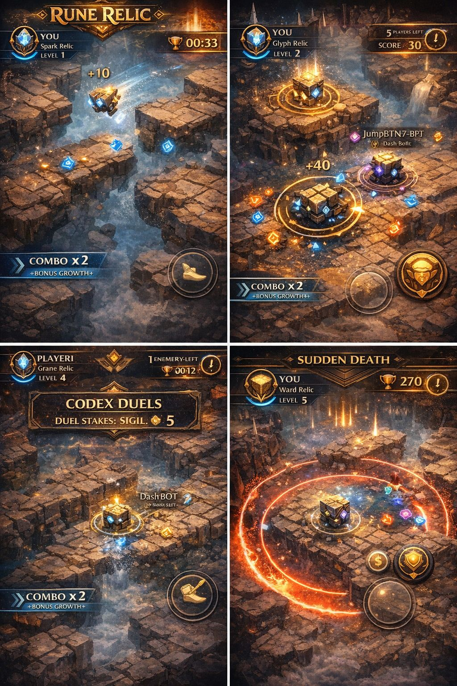
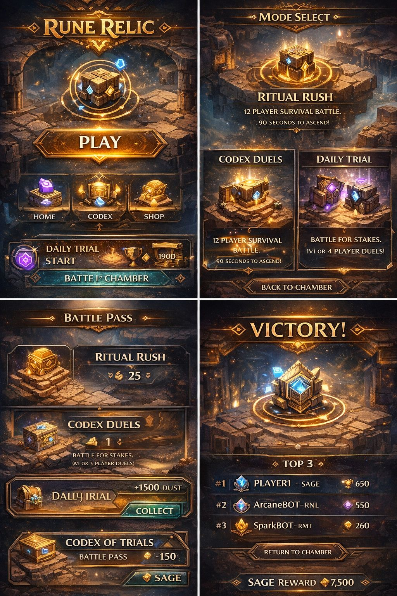

# Rune Relic

<div align="center">


**A Cryptographically Verifiable Multiplayer Battle Arena**

[](https://www.rust-lang.org/)
[](LICENSE)
[]()
[]()

[Play Now](#) | [Documentation](#architecture) | [Contributing](#contributing)

</div>

---

## Overview

**Rune Relic** is a fast-paced multiplayer survival arena where players compete to evolve, dominate shrines, and outlast opponents. Built with **100% deterministic game logic**, every match can be cryptographically verified on-chain using STWO proofs.

<div align="center">


</div>

### Key Features

- **12-Player Survival Battles** - Fast 90-second matches with evolving gameplay
- **5 Evolution Forms** - Progress from Spark to Ancient, each with unique abilities
- **Strategic Shrine Control** - Capture and channel power for massive advantages
- **Verifiable Outcomes** - Every match generates cryptographic proofs
- **Cross-Platform** - Server runs anywhere Rust compiles

---

## Game Modes

| Mode | Players | Description |
|------|---------|-------------|
| **Ritual Rush** | 12 | Classic survival battle - 90 seconds to ascend |
| **Codex Duels** | 1v1 / 4 | Competitive stakes matches |
| **Daily Trial** | 12 | Daily challenge with bonus rewards |

<div align="center">


</div>

---

## Architecture

```
rune-relic/
├── rune-relic-server/     # Authoritative game server (Rust)
│   ├── src/
│   │   ├── core/          # Deterministic primitives
│   │   │   ├── fixed.rs   # Q16.16 fixed-point math
│   │   │   ├── vec2.rs    # 2D vector operations
│   │   │   ├── rng.rs     # Seeded Xorshift128+ PRNG
│   │   │   └── hash.rs    # State hashing (SHA-256)
│   │   │
│   │   ├── game/          # Game logic (100% deterministic)
│   │   │   ├── state.rs   # Match & player state
│   │   │   ├── tick.rs    # 60Hz simulation loop
│   │   │   ├── collision.rs
│   │   │   ├── ability.rs # Form-specific abilities
│   │   │   ├── rune.rs    # Collectible runes
│   │   │   └── shrine.rs  # Shrine mechanics
│   │   │
│   │   ├── network/       # WebSocket multiplayer
│   │   │   ├── server.rs  # Async game server
│   │   │   ├── protocol.rs# Wire format
│   │   │   └── session.rs # Match lifecycle
│   │   │
│   │   └── proof/         # Cryptographic verification
│   │       ├── transcript.rs  # Match recording
│   │       ├── merkle.rs      # Commitment trees
│   │       ├── public_inputs.rs # STWO M31 encoding
│   │       └── verify.rs      # Replay verification
│   │
│   └── Cargo.toml
│
└── assets/                # Game screenshots & media
```

### Determinism Guarantee

The `core/` and `game/` modules are **100% deterministic**:

- No floating-point arithmetic in game logic
- No HashMap (BTreeMap for sorted iteration)
- No system time dependencies
- All randomness from seeded PRNG

> Given identical inputs and RNG seed, the simulation produces **identical results** on any platform (x86, ARM, WASM, GPU).

---

## Quick Start

### Prerequisites

- [Rust 1.75+](https://rustup.rs/)

### Build & Run

```bash
# Clone the repository
git clone https://github.com/Bitsage-Network/Rune-Relic.git
cd Rune-Relic/rune-relic-server

# Run tests (118 tests)
cargo test

# Build release binary
cargo build --release

# Run the server
./target/release/rune-relic-server
```

### Configuration

```rust
ServerConfig {
    bind_addr: "0.0.0.0:8080",
    max_connections: 1000,
    tick_rate: 60,
    enable_ranked: true,
}
```

---

## Evolution Forms

Players evolve by collecting runes. Each form has unique stats and abilities:

| Form | Tier | Speed | Ability | Cooldown |
|------|------|-------|---------|----------|
| **Spark** | 1 | Fastest | Dash | 3s |
| **Glyph** | 2 | Fast | Phase Shift | 5s |
| **Ward** | 3 | Medium | Repel | 6s |
| **Arcane** | 4 | Slow | Gravity Well | 7s |
| **Ancient** | 5 | Slowest | Consume | 8s |

> Higher forms can eliminate lower forms on collision!

---

## Rune Types

| Rune | Color | Effect |
|------|-------|--------|
| Wisdom | Blue | Base points |
| Power | Red | Bonus points |
| Speed | Yellow | 5s speed buff |
| Shield | Green | 5s shield (wins ties) |
| Arcane | Purple | Rare, high points |
| Chaos | Rainbow | Random effect |

---

## Cryptographic Proofs

Every ranked match generates a **verifiable transcript**:

```rust
MatchTranscript {
    metadata: MatchMetadata,      // Match ID, RNG seed, players
    initial_state: StateHash,     // Starting conditions
    player_inputs: Vec<InputDelta>, // Delta-compressed inputs
    checkpoints: Vec<StateHash>,  // Every 10 seconds
    result: MatchResult,          // Winner, placements
}
```

### Verification Flow

1. **Commit** - Players commit to match before block hash is known
2. **Play** - Server records all inputs and state checkpoints
3. **Finalize** - Generate transcript and state hashes
4. **Verify** - Anyone can replay and verify the outcome
5. **Prove** - Optional STWO proof for on-chain settlement

---

## API Reference

### WebSocket Protocol

**Connect:** `ws://server:8080`

#### Client Messages

```json
{ "type": "auth", "player_id": "...", "token": "..." }
{ "type": "matchmaking", "mode": "casual" }
{ "type": "input", "tick": 100, "move_x": 50, "move_y": -30, "flags": 1 }
{ "type": "ready" }
```

#### Server Messages

```json
{ "type": "match_found", "match_id": "...", "players": [...] }
{ "type": "match_start", "rng_seed": 12345, "players": [...] }
{ "type": "state", "tick": 100, "players": [...], "state_hash": "..." }
{ "type": "event", "event": "player_evolved", "player_id": "...", "new_form": 2 }
{ "type": "match_end", "winner_id": "...", "placements": [...] }
```

---

## Testing

```bash
# Run all tests
cargo test

# Run specific module tests
cargo test game::tick
cargo test proof::verify

# Run with output
cargo test -- --nocapture
```

### Test Coverage

| Module | Tests | Coverage |
|--------|-------|----------|
| core/ | 18 | Fixed-point, RNG, hashing |
| game/ | 42 | State, tick, collision, abilities |
| network/ | 20 | Protocol, sessions, server |
| proof/ | 38 | Merkle, transcript, verification |

---

## Performance

| Metric | Value |
|--------|-------|
| Tick Rate | 60 Hz |
| State Update | ~50 μs |
| Players/Server | 1000+ |
| Transcript Size | ~20 KB/match |
| Proof Generation | ~100ms (STWO) |

---

## Contributing

We welcome contributions! Please see our guidelines:

1. Fork the repository
2. Create a feature branch (`git checkout -b feature/amazing-feature`)
3. Write tests for new functionality
4. Ensure all tests pass (`cargo test`)
5. Submit a pull request

### Code Style

- Run `cargo fmt` before committing
- Run `cargo clippy` for lints
- Maintain 100% determinism in `core/` and `game/`

---

## Roadmap

- [x] Deterministic game engine
- [x] Fixed-point arithmetic
- [x] Evolution & ability system
- [x] Shrine mechanics
- [x] Rune collection
- [x] WebSocket multiplayer
- [x] Match transcript recording
- [x] STWO-compatible public inputs
- [ ] Unity/Godot client SDK
- [ ] On-chain match settlement
- [ ] Tournament system
- [ ] Spectator mode

---

## License

This project is licensed under the MIT License - see the [LICENSE](LICENSE) file for details.

---

## Links

- [BitSage Network](https://bitsage.network)
- [Discord Community](#)
- [Twitter](https://twitter.com/RuneRelicGame)

---

<div align="center">

**Built with Rust. Verified on BitSage.**

*Collect runes. Evolve. Dominate.*

</div>
